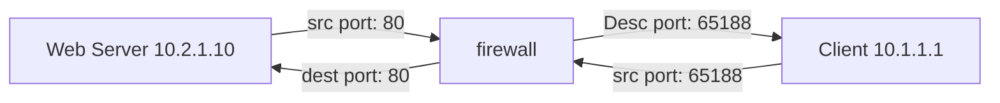

# AWS basics

**Availability zone and region**
Each zone is composed of one or more data centers. If you deploy to two different zones, you can make sure if one of them is down, your service is still available. Each region consists of two or more availability zone. Regions can talk to each other with high band low latency network (so not the internet).

---
**Pricing**

* Compute: based on amount of resources such as CPU, RAM and duration.
* Storage: based on quantity of data stored e.g. in databases
* Outbound data transfer: quantity of data that is transferred out from all services

---
**Identity and Access Management Service (IAM)**

When you first create an account on AWS with an email, that account will become the root user, it is a very powerful user that it is recommended not to use it for everyday work. IAM is the service that creates accounts.

* IAM user: entity that presents a person or a service
* IAM policy: documents that define permissions for users, groups or roles. There are predefined policies already available, but possible to create one yourself.
* IAM group: collection of users with a policy attached to them. Group > policy > create then user
* IAM role: a service can assume a role and get the permissions associated with the role. e.g. you can apply a role to amazon EC2 and that gives it permission to do things with other services.
* Authentication methods:
    - Access key is used for any programatic access to API
    - IAM user is for just the console

---
**Amazon Virtual Private Cloud (VPC)**

A virtual space where you can lunch your resources. A logically isolated portion of the AWS cloud within a region. You can have multiple VPC in a region or VPCs in different region, BUT each VPC must be contained in one region. You can then create subnets within your VPC and those are assigned to an availability zone. Subnets are where you place groups of isolated resources. Your VPC has an implicit router, and you use route tables to control where network traffic is directed. Each subnet in your VPC must be associated with a route table, which controls the routing for the subnet (subnet route table). You can explicitly associate a subnet with a particular route table. Otherwise, the subnet is implicitly associated with the main route table. A subnet can only be associated with one route table at a time, but you can associate multiple subnets with the same subnet route table.

A VPC router sends information between subnets in a VPC and a route table configures how to correctly send this information. The address block shows the range of IP addresses and the "Target": "local" tells us that these range are for internal communication. 0.0.0.0/0 is everything else, which will be other network, i.e. internet. So, if the destination address is within VPC range it knows that it should send it internally, else it will forward it to the internet gateway which is attached to the VPC.

Each VPC has a CIDR (Classless Inter domain Routing) block. This is the overall block of addresses from which you then create the addresses you then assign to your subnets. e.g. CIDR 10.0.0.0/16 for the VPC will have 10.0.0.0/24, 10.0.1.0/24, … addresses for the subnets within the VPC. You can now run e.g. your EC2 instances in the subnets. They are in a private cloud, in different data centres and they can talk with each other with a high band low latency network. Instances can be in public subnet or a private subnet. Public subnet means that the instance gets a public IP address and can use the internet gateway directly to access the internet. From subnets list,  “Auto assign public IP..“ will be set to Yes for these public subnets. Private subnet means instance cannot directly connect to the internet, but later you see there are ways around it.

---
**Security groups and Network ACLs (Access Control Lists)**

These are two different types of firewalls that we can apply to our AWS environment. NACLs apply at the subnet level, and apply only to traffic entering/exiting the subnet. A security group however applies at an EC2 instance level. Therefore, we can have instances in different subnets with same security groups applied to them. Security group is a stateful firewall and NACLs are stateless firewalls. A stateful firewall allows the return traffic automatically, while a stateless firewall check for an allow rule for both connections.

Aside from stateful/stateless, connection rules should be defined both for inbound and outbound traffic (Outbound means you initiate the connection and the traffic starts flowing outward of your computer to the destination you intended Example: you connect to a server. Inbound means someone else from outside of your computer initiate the connection to your computer, so the traffic starts flowing inward to your machine.) For security group rules, a source can be an IP address or security group ID, and by default security groups support allow rules only (deny is implicit). With Network ACLs you have an explicit deny, and rules are applied based on the order they have in the table (e.g. rule 99 has priority over 100).

---
**VPC Peering**

If you want to connect the machines (EC2, lambda,…) that are running in different VPCs together using IPv4 or IPv6., a way to do this is to use VPC peering, which allows routing internally (it means it is not going to the internet, it uses AWS global network and uses private IP addresses). Note that CIDR blocks of these two VPC that you want to connect must not overlap. Also note that VPC peering connections are not transitive and full mesh is required: what this means is that if you have VPC peering between VPC-A and VPC-B, and one between VPC-B & VPC-C, resources in VPC-A still cannot communicate with VPC-C and a third VPC peering is required. Due to this limitation, be aware that this approach can get messy if you have many VPCs, and other solutions are available in those cases.

---
**VPC endpoints**

Some AWS services are private and they run within a VPC (like EC2), while some are public that has public endpoints like AWS S3, which means you use a public DNS (public endpoint) to connect to it. Now, what if we want to connect an instance to S3 and you don’t want to use the internet because the instance is in private subnet. This is where you can use VPC endpoints. There are two different types: VPC gateway endpoint (to be used to connect to services like S3) and VPC interface endpoint (to be used to connect to some other AWS services). These are summarised below:

|  | Interface Endpoint | Gateway Endpoint |
| ----------- | ----------- | ----------- |
| what | Elastic Network Interface (ENI) with a private IP | A gateway that is a target for a specific route |
| how | Uses DNS entries to redirect traffic | Uses prefix lists in the route table to redirect traffic |
| which services | API Gateway, CloudFormation, CloudWatch | Amazon S3, DynamoDB |
| security | Security Groups | VPC endpoint policies |

---
**Private subnet and Bastion hosts (=jump server = jump host = Jump box)**

If you want to connect to an EC2 instance in a private subnet which does not have a direct access to the internet, you can use an EC2 instance in a public subnet to jump into the EC2 instance in a private subnet: this EC2 on public subnet is now acting as a jump server. Keep in mind that storing the ssh keys on Jump Box would beat the purpose of using it at the first place. So instead we store all ssh keys on our local machine and use agent forwarding when connecting by adding -A flag to our ssh command.

---
**Private subnet with NAT (Network Address Translation) gateway**

If you want to manage an EC2 instance in private subnet from an internet based client, you can use a Bastion host in a public subnet. But what we can’t do with a Bastion host is to allow outbound access, e.g. if your instance needs to update some packages or for some reason you need to connect to the internet. This is where a NAT gateway can help. Note that your NAT gateway needs to be in a public subnet and you need to have an Elastic IP address assigned to it.

---
**EC2 (Elastic Compute Cloud)**

EC2 allows you to launch compute resources on AWS cloud, which are called instances. These are similar to Virtual Machines. Each instance has an operating system, some storage and certain amount of virtual hardware associated with it (RAM, CPU, Network capabilitues). An Amazon Machine Image (AMI) is a template that contains the configurations stated above for your instance. There are lots of different images that are optimised for different use cases (micro instances, GPU instances, Memory instances, Machine learning instances,..). Elastic block store is the underlying storage behind EC2 instances. You could choose from few different types of EBS volumes (General Purpose SSD gp2, Provisioned IOPS SSD ip2, ….). Then there are security groups which are instance level firewalls. You can have multiple instances under the same security groups or have multiple security groups applied to same instance. As stated earlier, security groups are stateful (inbound & outbound rules are the same). Key pairs are used to access your linux AMI through ssh. If you launch an instance and you loose the key pair, you won’t be able to ssh to the instance. Instance metadata is data about your instance that you can use to configure or manage the running instance. As an example, to view all categories of instance metadata from within a running instance, run following command where you can get public host names, local host names, instance id, etc: `[ec2-user ~]$ curl http://169.254.169.254/latest/meta-data/` . Instance user data is information that you can pass to your instance while it boots. For instance, you can run some commands and install packages while instance is booting in the EC2 launch instance console. Similar to meta data to can retrieve this information when connected to your instance: `curl http://169.254.169.254/latest/user-data`. Each instance has a status check. You can trigger alarms that are based on the results of the status check, which are visible also in CloudWatch. Amazon CloudWatch is a service which collects performance metrics that are sent by other AWS services. With CloudWatch you can monitor many performance metrics associated with your Amazon EC2 instances. Public, private and Elastic IP address and their description is given in table below.

| name | description |
| ----------- | ----------- |
| Public IP address | lost when instance stopped. Used in public subnets. No charge. Associated with a private IP address on the instance. |
| Private IP address | retained when instanced is stopped. Used in public and private subnets. |
| Elastic IP address | Static public IP address. You are charged if not used. Associated with a private IP address on the instance |

As an example with a linux AMI, the Linux OS knows nothing about the public address, but AWS maps does the mapping between public IP and the default private IP of the instance. When data comes to this public IP address, the IGW will then swap the IP address from the public to a private one so that the OS can pick it up and process that data. Reverse procedure is done when data goes outbound. For Elastic IP address, when you create an Elastic IP, you can then associate it to an instance’s private IP address. An other approach is to create an elastic network interface (eth0, eth1) for a subnet plus a separate Elastic IP address. Then attach you Elastic IP address to this network interface. And then attach this network interface to your EC2 instance. An elastic network interface (ENI) is a logical networking component in a VPC that represents a virtual network card. It can include the following attributes:
* A primary private IPv4 address from the IPv4 address range of your VPC
* One or more secondary private IPv4 addresses from the IPv4 address range of your VPC
* One Elastic IP address (IPv4) per private IPv4 address
* One public IPv4 address
* One or more IPv6 addresses
* One or more security groups
* A MAC address
* A source/destination check flag
* A description

---
**EKS (Elastic Kubernetes Service), ECS (Elastic Container Service) & Fargate**

If you want to run containerised  applications on AWS, you have multiple options to choose from. Amazon itself offers a container orchestration tool called ECS. So, if you want to run a cluster on AWS, you can create a cluster in ECS where ECS will act as a control plane to manage your virtual machines that are running containers. The containers need to run on Virtual Machines. These VMs will be the EC2 instances which will host the containers for our applications. EC2 instances will be connected to this ECS cluster. All these EC2 instances will have Container runtime and ECS agent (for control plane communication) installed on them. However, in this scenario you still need to create the EC2 instances and join them to the cluster and check whether they have enough resources. If you also want to delegate  the management of the infrastructure to AWS, there is an option for that, and it’s Fargate. Fargate is an alternative to EC2 instances. So instead of creating and provisioning EC2 instances and connecting them to ECS cluster, you don’t need to provision any virtual machines and you just use Fargate interface and Fargate will take care of spinning up the VMs for you. Fargate is a serverless way to launch services:
> Serverless architecture is an approach to software design that allows developers to build and run services without having to manage the underlying infrastructure.

With Fargate, you just create your container and then hand it over to Fargate. Fargate will then analyze your container and see how much resources your container needs to run. And it will provision a server on demand for your container. So, you pay only for what you use and easily scales up and down. Now what if you want to use Kubernetes? There is another AWS service called EKS for managing Kubernetes cluster on AWS infrastructure and is an alternative to ECS. The pros and cons of EKS:
* If you are already using K8s
* Kubernetes is open source but ECS is specific to AWS and makes migration later difficult. However, if you are already using lots of services from AWS, then the migration to other platforms is already difficult.
* Large community (Helm charts etc)
* However, you pay for EKS while ECS control plane is free.

How EKS works?

With EKS, you create a cluster which represents the control plane. In K8s world these will be the master nodes. So, when you create an EKS cluster, AWS will create and manage all Kubernetes master nodes with master services already installed on them. Now you need the worker nodes, i.e. the infrastructure that runs your containers. Same as in ECS, you need to create EC2 instances (your compute fleet of multiple virtual servers) and connect those to your EKS cluster. However, same as before, you still need to manage the infrastructure for worker nodes. In EKS you have the possibility to choose a semi-managed EKS cluster with Nodegroups. You will group you instances into Nodegroups and these Nodegroups will handle some of the work for you, like installing container runtime etc. But if you still want a fully-managed EKS cluster, you can use Fargate here as well. 

---
**AWS lambda**

It is a compute service (like EC2 and ECS) that allows you to run code as functions. It is a serverless technology which means there is no server to manage. You just write your code (there are different supported languages: python, java, ..), add it to a function, and that function can run in response to certain triggers and invoke an arn (Amazon Resource Name). It has concurrency (running multiple times at the same time). Lambda is a great option if you want simplicity over customisation. But there are also some tradeoffs with Lambda such as you can only have 30min invocation time for a single Lambda function, and their pricing model is different. With EC2 and ECS, you only pay for the EC2 instances, but with Lambda you are paying for the number of invocation, memory allocation for each of these invocations and the duration of these invocations. Overall, Lambda can be used even for hosting a very large application, however, lots of complexities and customisation possibilities are hidden from you. So, it is best to start with Lambda if you are just prototyping something, and then switch to something else if you see Lambda functions are not working for you.

---
**RDS**

Amazon rds is a managed relational database service. Relational is a type of database where you have a rigid schema so the database defines the rows and the columns and you have to define that at the beginning and then stick to it. RDS runs on amazon ec2 instances so when you launch your database you have to choose the ec2 instance type (cpu, memory, ..). You can change the instance type at any time, but your database will be taken offline while that happens. Supported engines: 
* amazon aurora (amazon's own proprietary database)
* MySQL
* postgresql
* etc

For all of engines except for amazon aurora you could just launch an ec2 instance and then install this database software yourself. You might do that if you want to have control at the actual ec2 instance level so it means that you will then have root access to the operating system of ec2. However, you lose out on the managed service which you get with RDS. With RDS you don't get access to the operating system but you do have a managed service so things like patching and backups are taken care of automatically. There are three terminologies around this:

1. Multi-AZ is the disaster recovery technology. In this case you have your RDS master. This database is then replicating synchronously to a standby database that is in another availability zone (synchronous replication means when you replicate, you wait for the destination to respond but there can be a performance penalty because of that). The standby is not actually used it's just there and available so if your master failed for some reason you would then be able to use your standby, it would then become the new master.
2. Scale up (vertically): change instance type and adding more cpu, memory to your instance.
3. Scale out (horizontally): you add an additional database. It's called a read replica and it's only used for reads so it uses asynchronous replication. This means it doesn't wait for a response to confirm the data has been updated and the read replica is therefore used only for applications to read traffic so you can configure your application to use the read replica to query the database and to use master to write data to the database. Read replicas is all about offloading read performance from the master.
 
---
**Dynamodb**

non-relational database service

---
**References**
1. [Digital Cloud Training Youtube channel](https://www.youtube.com/@DigitalCloudTraining/)