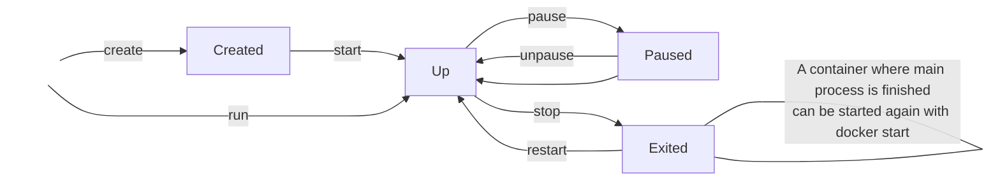

**Lifecycle of a docker container**


---
**Dockerfile**

Dockerfile is a blueprint for building images. Following are common syntax of a Dockerfile.

* Whatever image you are building, you need to base it on another image: `FROM <base-image>`
* We can define environmental variables in a docker container. Although the alternatives of passing environment variables via docker run or docker compose is better as you can change this easily and don’t need to rebuild the image: `ENV <KEY=value>`
* You can run any linux commands with the RUN command: `RUN mkdir -p /home/app`
* To copy files from host to container, use COPY command. This is different from RUN cp .. as the latter will run only on the container not the host. `COPY . /home/app`
* The ENTRYPOINT specifies a command that will always be executed when the container starts: `ENTRYPOINT ["/bin/ping"]`, `ENTRYPOINT ["docker-entrypoint.sh"]`
* The CMD specifies arguments that will be fed to the ENTRYPOINT. Otherwise, if you want to make an image for general purpose, you can leave ENTRYPOINT unspecified and use `CMD ["/path/command"]` as you will be able to override the setting by supplying arguments to docker run.
```
FROM debian:wheezy
ENTRYPOINT ["/bin/ping"]
CMD ["localhost"]
```
Running the image without any argument will ping the localhost (docker run -it test). running the image with an argument will ping the argument (docker run -it test google.com). For comparison:

```
FROM debian:wheezy
CMD ["/bin/ping", "localhost"]
```
Running the image without any argument will ping the localhost (docker run -it test). But running the image with an argument will run the argument (docker run -it test bash).

---
**docker compose**

> Compose is a tool for defining and running multi-container Docker applications. With Compose, you use a YAML file to configure your application’s services. Then, with a single command, you create and start all the services from your configuration.

Docker compose makes building and running containers easier, compared to using docker basic CLI, especially if you have multiple containers that you need to run, and containers need to have a network. Docker compose takes care of creating a common network and removes the need for --net <network-name> when running container.

Example boilerplate:
```
version: '2'
services:
  www:
    image: allen-test:tag
    build:
      context: www/.
      dockerfile: Dockerfile
    container_name: www
    command: python -m app.main
    environment:
      - "ENV=staging"
      - "PYTHONPATH=/srv/legal"
    ports:
     - "8000:8000"
    volumes:
     - .:/srv/legal
    links:
      - db
    depends_on:
     - db
  db:
    container_name: db
    image: mongo
    ports:
      - "27017:27017"
    volumes:
      - ./db/data:/data/db
```
Some basic commands:
- `docker-compose start` # Starts existing containers for a service.
- `docker-compose stop` # Stops running containers without removing them.
- `docker-compose pause` # Pauses running containers of a service.
- `docker-compose unpause` # Unpauses paused containers of a service.
- `docker-compose ps` # Lists containers.
- `docker-compose up` # Builds, (re)creates, starts, and attaches to containers for a service.
- `docker-compose down` # Stops containers, removes containers, networks, volumes, and images created by up.

---
**docker volume**

When you restart or remove a container, data is lost. Docker volumes are typically used for data persistence, for instance a database or other stateful applications. In simple terms, a directory in physical host file system is mounted into the virtual file system of docker. So, when container writes to the mounted volume, it gets automatically updated in host as well, and vice versa. There are 3 types of docker volumes:
1. Host volumes: here we define the connection between host directory and the container directory. This is typically used in development: `docker run -v /home/mount/data:/var/lib/mysql/data`
2. Anonymous volumes: here we define the volume just by referencing the container directory. `docker run -v /var/lib/mysql/data`. We don’t specify where this directory will be mounted in host, and docker will take care of it for us under `var/lub/docker/volumes/random-hash/_data`
3. Named volumes: is an improvement of anonymous volumes where you name the folder in host. `docker run -v name:/var/lib/mysql/data` This is the mostly used, and for production, this must be used `var/lub/docker/volumes/random-hash/_data`

Above examples where using the docker run command, but the same applies using docker compose as well. When you name the volumes, you can then share this volume between multiple containers in your yaml file by just referencing the name. Note that at the end of the yaml file you list all the volumes.

---
**reference**
1. [Dockerfile Tutorial - Docker in Practice || Docker Tutorial 10](https://youtu.be/WmcdMiyqfZs)
2. [Docker Volumes explained in 6 minutes](https://youtu.be/p2PH_YPCsis)