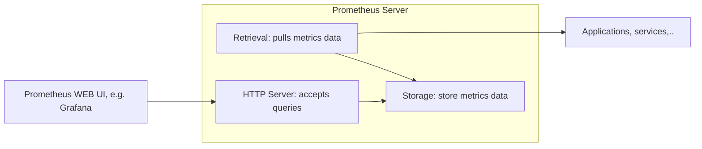
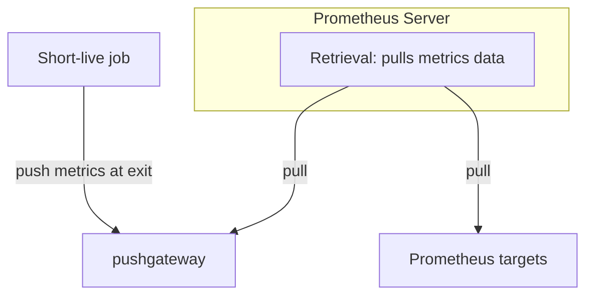

**What is Prometheus?**

Prometheus was created for monitoring highly dynamic container environments (e.g. K8s) but it can also be used on bare servers. Over the past years prometheus has become the most used tool for monitoring container & microservice infrastructure.

---
**Prometheus Server**

At its core, Prometheus has its main component called Prometheus server, which does the actual monitoring work and is comprised of three parts:
1. Timeseries Database which stores all metric data (e.g. current CPU usage)
2. Data retrieval worker which is responsible for pulling metrics data from applications, services or other resources (they are called Targets) and pushing them into database.
3. Web server or server API that accepts queries for that stored data (Accepts PromQL queries). This server API is then used to visualise the data in a dashboard, either Prometheus dashboard or other visualisation tools like Grafana.


---
**Metrics**

Prometheus uses human-readable text-based format for the metrics. Metrics entries have TYPE and HELP attributes to help readability. Help is the description of what the metric is. Type is one of the three metrics types:
1. Counter type. How many times x happened? e.g. numbers of requests a service has recieved. 
2. Gauge type. What is the current values of x now? e.g. what is the current CPU usage now?
3. Histogram type. How long or how big? e.g. how big the size a request was.

Prometheus pulls the metrics from Targets from an HTTP endpoint which by default is at `hostaddress/metrics`. For this to work:
* the target needs to expose `/metrics`
* the data available at `/metrics` must be in a format that Prometheus can understand.

---
**Exporter**

Some servers already expose `/metrics` endpoint by default, so no extra work is needed, but many services don’t have native Prometheus endpoint, and thus another component is needed to do that. This component is Exporter. An exported is a service or script that fetches metrics from Target and converts it to correct format that Prometheus can read and exposes this converted data at its own `/metrics` endpoint where Prometheus can then scrape them. Prometheus has a list of exporters for different services like cloud platforms, Linux servers, etc. So for instance if you want to monitor a Linux server, you can download a node exporter tar file from Prometheus repository. You then untar and execute it, and it will start converting the metrics of the server and making them scrap-able at its own `/metrics` endpoint, and you then go and configure Prometheus to scrape that endpoint. These exporters are also available as docker images. For instance if you want to monitor your MySQL container in K8s, you can deploy a side container of MySQL exporter that will run inside the pod with MySQL container, connect to it and start translating MySQL metrics for Prometheus and making them available at its own `/metrics`. And again once you add mysql exporter endpoint to prometheus configuration prometheus will start collecting those metrics and saving them in its database.

What about monitoring your own applications? For this use case, there are prometheus client libraries for different languages like node.js, java etc using these libraries you can expose the slash metrics scraping endpoint in your application and provide different metrics that are relevant for you on that endpoint.

---
**Pull mechanism and pushgateway**

Most monitoring systems like amazon cloud watch use a push system meaning applications and servers are responsible for pushing their metric data to a centralized collection platform of that monitoring tool. When you're working with many microservices and you have each service pushing their metrics to the monitoring system, it creates a high load within your infrastructure and your monitoring can actually become your bottleneck. You have monitoring which is great but you pay the price of overloading your infrastructure plus you also have to install daemons on each of these targets to push the metrics to monitoring server. 

However, prometheus requires just a scraping endpoint and this way metrics can also be pulled by multiple prometheus instances. Another advantage of that is, using pull, prometheus can easily detect whether service is up and running. While with push if the service doesn't push any data or send its health status it might have many reasons other than the service isn't running, e.g. it could be that network isn't working, or the package got lost on the way. But there are limited number of cases where a target that needs to be monitored runs only for a short time so they aren't around long enough to be scraped, example could be a batch job or scheduled job, for such jobs prometheus offers push gateway component so that these services can push their metrics directly to prometheus database:


---
**Configuring Prometheus**

How does prometheus know what to scrape and when? All that, is configured in `prometheus.yaml` configuration file. You define which targets prometheus should scrape and at what interval. Prometheus then uses a service discovery mechanism to find those target endpoints. When you first download and install prometheus you will see the sample config file with some default values in it.
```
global:
	scrape_interval: 15s
	evaluation_interval: 15s

rule_files:
	- first.rule
	- second.rule

scrape_configs:
	- job_name: prometheus
	  static_configs:
		  - targets: ["localhost:9090"]
```

 In example above, we have:

* global config that defines scrape interval or how often prometheus will scrape its targets and you can override these for individual targets
* The rule files block specifies the location of any rules we want prometheus server to load and the rules are basically either for aggregating matrix values or creating alerts when some condition is met. So prometheus uses rules to create new time series entries. The evaluation interval option in global config defines how often prometheus will evaluate these rules. 
* `scrape_configs` block, controls what resources prometheus monitors. This is where you define the targets. Since prometheus has its own metrics endpoint to expose its own data it can monitor its own health.

---
**Alert manager**
How does prometheus actually trigger the alerts that are defined by rules, and who receives them? Prometheus has a component called alert manager that is responsible for firing alerts via different channels (email, slack, other notification clients). Prometheus server will read the alert rules and if the condition in the rules is met an alert gets fired through that configured channel.

---
**Data storage**

Where does prometheus store all this data that it collects and then aggregates and how can other systems access this data? Prometheus stores the metrics data on disk so it includes a local on disk time series database but also optionally integrates with remote storage system. The data is stored in a custom time series format and because of that you can't write prometheus data directly into a relational database. Once you've collected the metrics, prometheus also lets you query the metrics data on targets through its server api using promptQL query language. You can use prometheus dashboard ui to ask the prometheus server via promptQL to for example show the status of a particular target right now. Or you can use more powerful data visualization tools like Grafana to display the data which under the hood also uses promptQL to get the data out of prometheus. With Grafana instead of writing promptQL queries directly into the prometheus server, you basically have Grafana ui where you can create dashboards that can then in the background use promptQL to query the data that you want to display.

---
**Prometheus with docker and K8s**

Prometheus is fully compatible with both, and prometheus components are available as docker images. They can easily be deployed in Kubernetes or other container environments. It integrates great with Kubernetes infrastructure providing cluster node resource monitoring out of the box which means once it's deployed on Kubernetes it starts gathering matrix data on each Kubernetes node server without any extra configuration.

---
**references**
1. [How Prometheus Monitoring works | Prometheus Architecture explained](https://youtu.be/h4Sl21AKiDg)