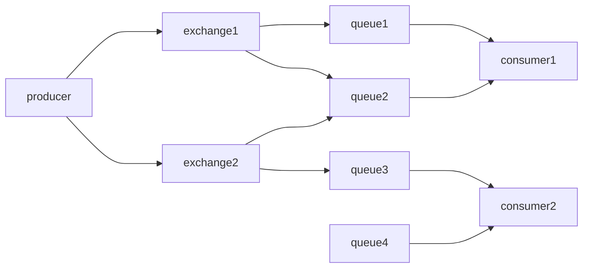
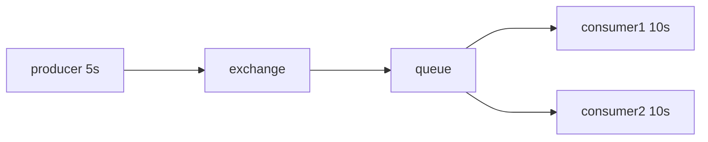
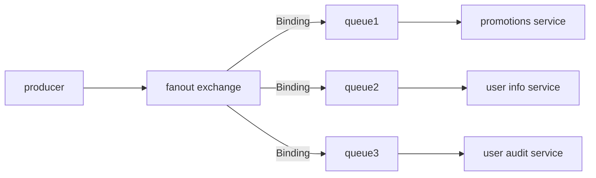
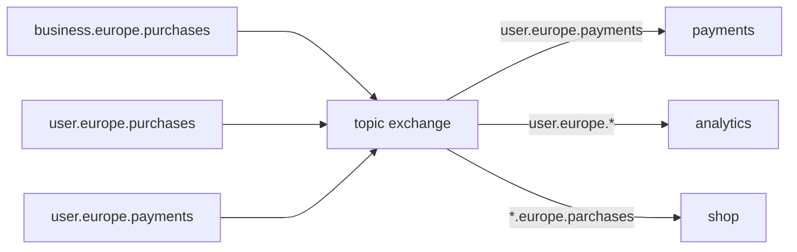
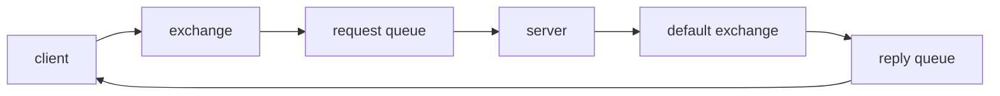
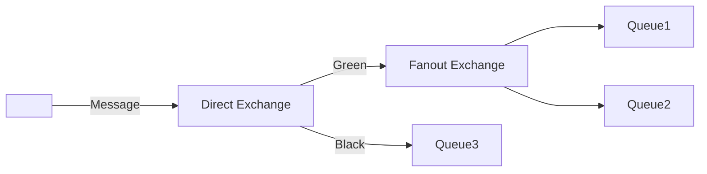
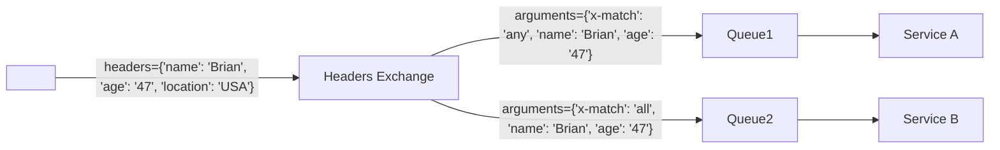

# RabbitMQ

RabbitMQ (RMQ) is an open-source distributed message queue software written in Erlang.

> Distributed computing is a field of computer science that studies distributed systems. A distributed system is a system whose components are located on different networked computers, which communicate and coordinate their actions by passing messages to one another from any system. The components interact with one another in order to achieve a common goal. Three significant challenges of distributed systems are: maintaining concurrency of components, overcoming the lack of a global clock, and managing the independent failure of components

Benefits of using a message broker
- Provided communication between services that may not be running at the same time. 
- Improved system performance by introducing asynchronous processing. 
- Increased reliability by guaranteeing the transmission of messages.

Disadvantages of using a message broker
- most challenges are related to the use of asynchronous calls
- Increased system complexity 
- Debugging can be harder
- There might be a steep learning curve at first

---
**Core concepts**

* Producer: Publishes a message to RabbitMQ.
* Consumer: Entities or programs that are listening to messages that are coming off the broker. We can have multiple consumers listening to the same message coming from the broker, or multiple producers pushing messages to the same message broker. Both ways the communication is asynchronous.
* Exchange: Exchange is the brains behind the message broker. It knows how to route our message from producer to consumer. There are many types of exchanges to cover many types of scenarios. A message broker may have many different exchanges and an exchange is where a producer sends its messages to. RMQ has four exchange types by default:
    1. direct exchange
    2. fanout exchange
    3. headers exchange
    4. topic exchange

* Queue: An exchange will push messages to one or more queues. Messages will sit in these queues until they are read by the interested consumers. Like an exchange, a message broker might have multiple queues. 
* Binding: Queues are tied to exchanges with what is known as binding.
* Connections: Every producer or consumer should open a single TCP connection to RMQ broker.
* Channel: A connection can have multiple channels. By using multiple channels, a producer for example, can push messages to broker using different threads, but because these threads are using different channels, these messages are isolated from one another. By using channels and not opening multiple connections we can save a lot of resources.

---
**AMQP**

Advance Message Queuing Protocol (AMQP) is an open standard for passing business messages between applications or organisations. RabbitMQ is not the only message broker that uses AMQP, others are Apache ActiveMQ and Azure Service Bus.

---
**Messaging patterns and common scenarios**

#### Competing consumers
This is used when we have a resource expensive task to complete and we might have to wait a while for the task to complete. And we don’t want our client to wait in the meantime. This pattern also improves our scalability and reliability as we can simply increase the number of consumers or if one node goes down we still have other consumers to handle the workload. This pattern uses the default exchange type which is “direct exchange“. In case the consumers take different time to consume the messages, since by default the RMQ does not count the amount of unacknowledged messages on a consumer, it will wait for each consumer in a consequent fashion to consume. To overcome this, you can set the prefetch value of 1 not to give one more message at the a time to a worker while it has a message in flight.

#### Pub/Sub (Publish/Subscribe)

This is the opposite of competing consumers where we shared one message across multiple consumers. This is used when we have multiple micro-services which might be interested in the same message. This pattern uses an exchange called “fanout“ exchange, and as the brain of the broker, it decides which consumers are interested to receive a message. In this scenario, we decouple the producer from the consumers, so the producer does not have to know which consumers will be interested in receiving a message. We need to bind our exchange to the queues and with this binding the fanout exchange knows what consumers are interested in the message. For instance, in scenario below, the “Payments Service“ won’t receive the “User created” message since there is no binding to that exchange. Note that messages are not duplicated but a reference to the actual message is used to refer to a message.

#### Routing

In the previous setup, the exchange just looked at the binding and not the message content to decide on the queues. If we want to only route messages with certain content, we need to use either a “direct exchange” or a “topic exchange”. With direct exchange, we use binding keys to define which consumers are interested to the messages. With topic exchange, however, we will have more flexibility using * or # to further filter by routing keys.

#### Request-Reply
The request reply pattern allows us to send a request into RMQ specifying a queue that we would like a reply to be sent to when the consumer consumes this message. It's able to send the reply onto the queue you've specified. As usual we will have a producer and a consumer but in this case because both services are both consuming and publishing messages we won't call them a producer and a consumer instead we will call them a client and a server. The server knows which reply queue to send the reply to, because the client specifies this reply queue when publishing the message using the `reply_to` property. This property will be passed all the way to the server. If the client sends multiple message, some metadata needs to be provided on the request so that the server knows which reply is for which request by using the same tag. The `message_id` or `correlation_id` is often used to convey this information.

#### Exchange-Exchange Routing
With direct exchange, you can use routing key to route messages. But it is possible that based on the key, you may want to use other exchange type for certain messages.

#### Headers Exchange
This is similar to direct exchange as it uses some parameters to decide where to route the message to, in this case, it uses the contents of the header to do so. These headers are sent to the exchange using the basic property data structure, which are basically a list of key-value pairs. The header exchange is then bind to one or more queues similar to direct exchange. Here, the binding arguments will be a list of key-value pairs and one of them will be called x-match which could be any or all, which are the rules.

---
**references**
1. [RabbitMQ Tutorial by jumpstartCS](https://www.youtube.com/playlist?list=PLalrWAGybpB-UHbRDhFsBgXJM1g6T4IvO)